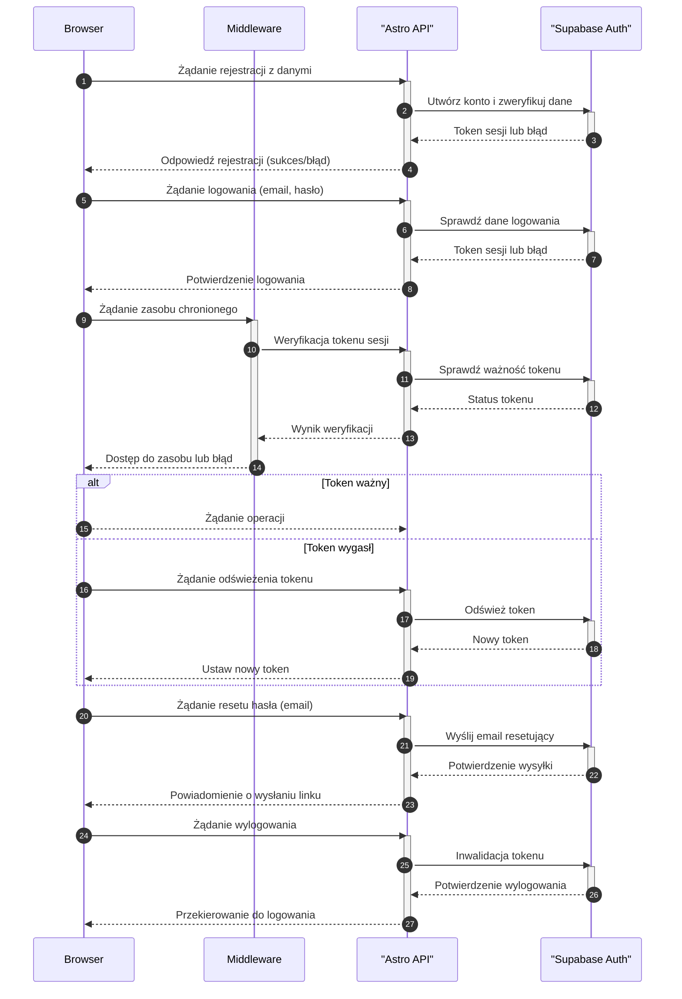

<authentication_analysis>

- Przepływy autentykacji z dokumentów:
  • Rejestracja: Użytkownik wysyła dane rejestracyjne; API komunikuje się z Supabase Auth,
  który tworzy konto i zwraca token.
  • Logowanie: Użytkownik podaje email i hasło; API weryfikuje dane przez Supabase Auth
  i wydaje token sesji.
  • Reset hasła: Użytkownik wysyła email; API inicjuje wysłanie linku do resetu hasła.
  • Wylogowanie: Użytkownik wysyła żądanie wylogowania; API inwaliduje token.
- Główni aktorzy:
  • Browser – klient użytkownika.
  • Middleware – warstwa weryfikująca tokeny przy żądaniach.
  • Astro API – backend obsługujący endpointy autentykacji.
  • Supabase Auth – dostawca autentykacji i zarządzania sesjami.
- Procesy:
  • Weryfikacja tokenu: Każde żądanie do chronionego zasobu weryfikowane jest przez API.
  • Odświeżanie tokenu: W przypadku wygaśnięcia tokenu, API odświeża go przez Supabase Auth.
  </authentication_analysis>

<mermaid_diagram>

</mermaid_diagram>
